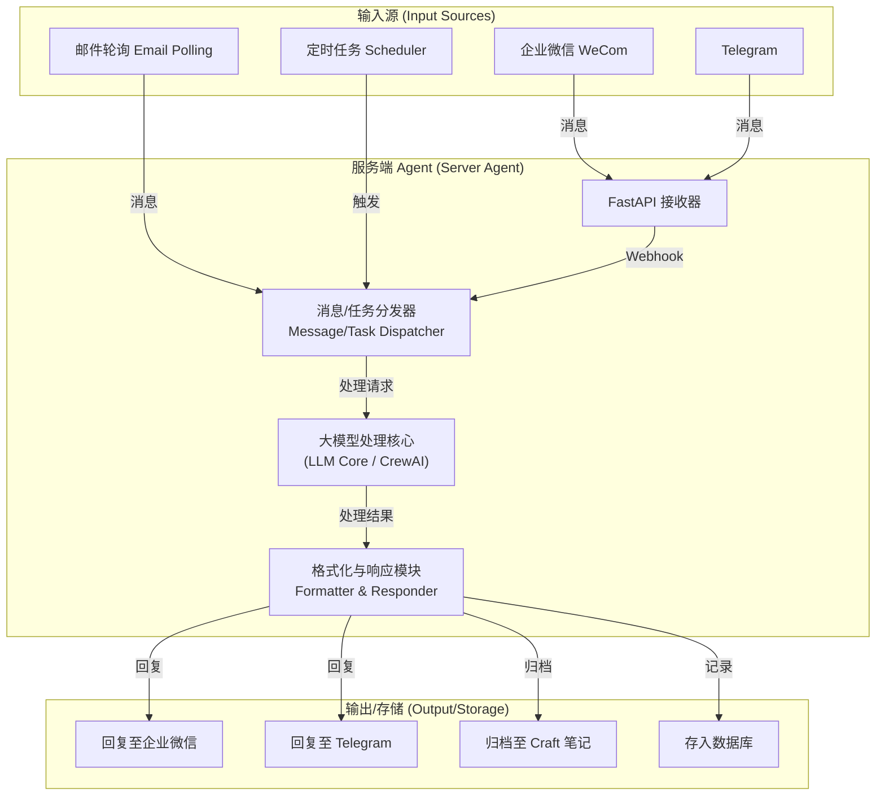

```mermaid
graph TD
    subgraph "输入源 (Input Sources)"
        A[企业微信 WeCom]
        B[Telegram]
        C[邮件轮询 Email Polling]
        D[定时任务 Scheduler]
    end

    subgraph "服务端 Agent (Server Agent)"
        E[FastAPI 接收器]
        F[消息/任务分发器<br/>Message/Task Dispatcher]
        G["大模型处理核心<br/>(LLM Core / CrewAI)"]
        H[格式化与响应模块<br/>Formatter & Responder]
    end

    subgraph "输出/存储 (Output/Storage)"
        I[回复至企业微信]
        J[回复至 Telegram]
        K[归档至 Craft 笔记]
        L[存入数据库]
    end

    A -- 消息 --> E
    B -- 消息 --> E
    C -- 消息 --> F
    D -- 触发 --> F

    E -- Webhook --> F
    F -- 处理请求 --> G
    G -- 处理结果 --> H

    H -- 回复 --> I
    H -- 回复 --> J
    H -- 归档 --> K
    H -- 记录 --> L
```
